# The First Foreigner    
<p align="center">
  >
	
	
	
</p>

## 🎮 게임 플레이
- **직접 플레이**   
   [Steam](https://store.steampowered.com/app/3634090/The_First_Foreigner/)에서 게임 다운로드 후 실행합니다.
- **플레이 영상**   
   [YouTube](https://www.youtube.com/watch?v=AIy8zwr5r8M)에서 플레이 영상을 시청할 수 있습니다.

## 📌 프로젝트 소개
- **프로젝트 개요**   
  Unreal Engine으로 제작한 3D 멀티플레이 캐주얼 게임\
  두 명의 플레이어가 번갈아 제시어를 행동이나 사물로 표현하고 상대가 이를 추리해 맞춤
- **개발 기간**   
  2024.09.10 ~ 2024.12.06 : 리슨 서버 기반 빌드 개발 완료\
  2025.05.17 ~ 2025.06.09 : Online Subsystem 기반 빌드 개발 완료
- **개발 상태**   
  Steam 게시 완료 (개발 종료)
- **개발 환경**   
  Unreal 5.2.1\
  Windows 10 (64bit)
- **멤버 구성**   
  기획 및 레벨 디자인 1명\
  프로그래밍 1명

## 🎯 담당 업무
- Unreal Gameplay Framework 기반 **게임 플레이 로직** 구현   
- Replication·RPC 기반 클라이언트–서버 **데이터 동기화 및 명령 처리**   
- Animation Blueprint·AnimInstance·State Machine 기반 캐릭터 **애니메이션 제어**   
- Widget Blueprint 기반 **동적 UI** 제작 및 **데이터 연동**   
- Online Subsystem 기반 **세션 관리**

## ⚙️ 기능 구현
### 1. 캐릭터 이동 및 애니메이션 제어
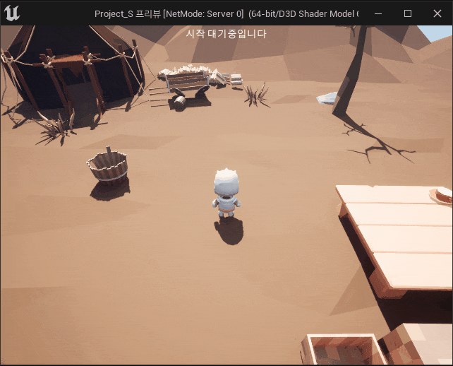

- **기능 설명**:   
	- **W**, **A**, **S**, **D** : 전, 좌, 후, 우로 이동   
 	- **Mouse Drag**: 시선 이동   
 	- **LShift** : 달리기   
	- **Space**: 점프   
- **주요 기술**:
	- **Enhanced Input**으로 액션 정의 및 바인딩   
	- **AnimInstance**를 활용한 파라미터 갱신   
 	- **State Machine** 기반 상태 전이   
- **구현 방법**:
	- **액션 정의** : 입력 액션에서 값 타입 정의, 입력 매핑 컨텍스트에서 키 매핑·값 가공
		<details>
			<summary> <em>코드 펼치기/접기</em></summary>
		
		<p>
			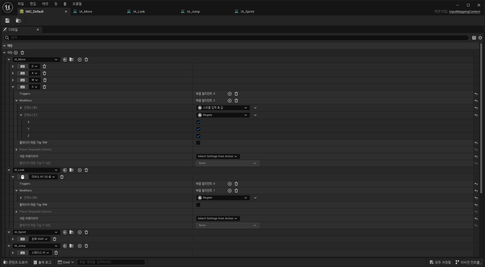
		</p>
  		<p>
			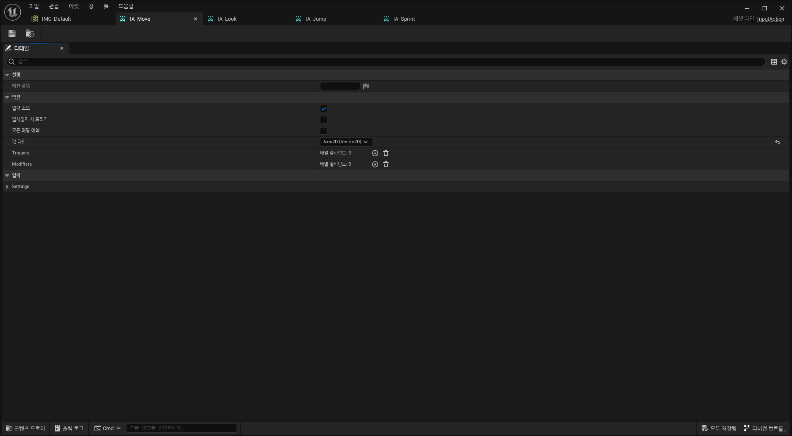
			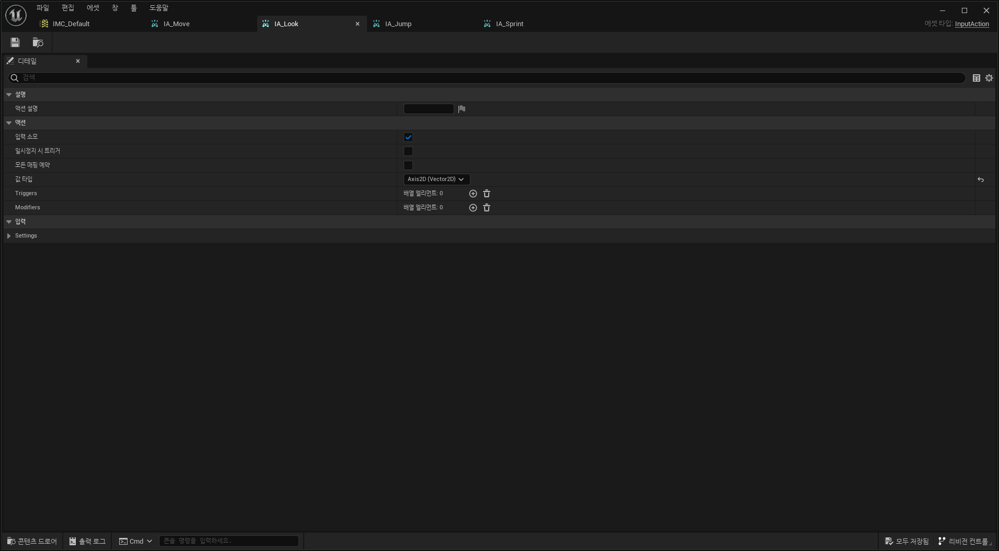
			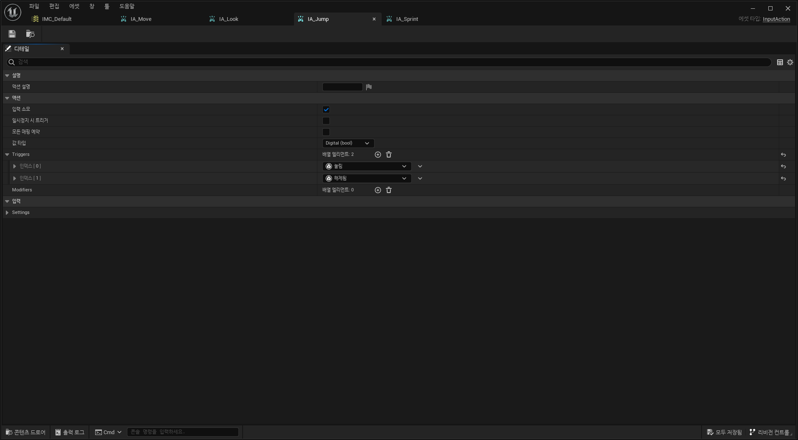
			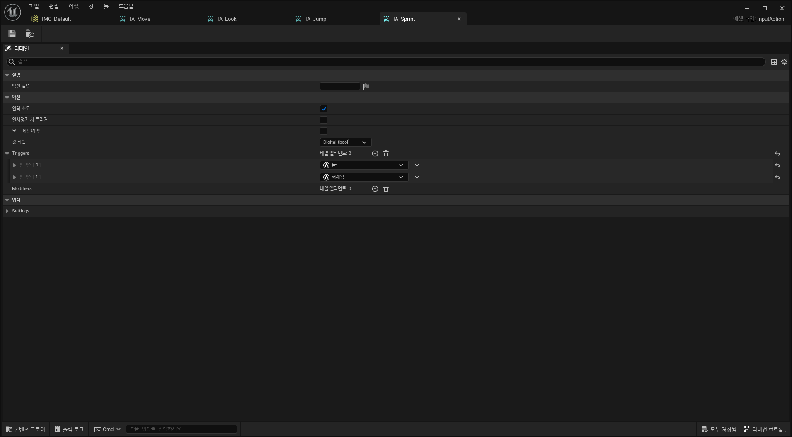
		</p>
  		</details> 
	
	- **액션 바인딩** : SetupPlayerInputComponent()에서 액션과 콜백 함수 바인딩  
		<details>
			<summary> <em>코드 펼치기/접기</em></summary>
		
		```c++
		void APS_Character::SetupPlayerInputComponent(UInputComponent* PlayerInputComponent)
		{
		  ︙
			EnhancedInputComponent->BindAction(MoveAction, ETriggerEvent::Triggered, this, &APS_Character::Move);
  			EnhancedInputComponent->BindAction(LookAction, ETriggerEvent::Triggered, this, &APS_Character::Look);
  			EnhancedInputComponent->BindAction(SprintAction, ETriggerEvent::Started, this, &APS_Character::SprintStart);
  			EnhancedInputComponent->BindAction(JumpAction, ETriggerEvent::Started, this, &APS_Character::JumpStart);
		  ︙
		}
		```
  		</details>
  
	- **액션 처리** : 입력을 받아 바인딩된 함수에서 캐릭터 상태 갱신
		<details>
			<summary> <em>코드 펼치기/접기</em></summary>
		
		```c++
  		// 이동
		void APS_Character::Move(const FInputActionValue& Value)
		{
		  ︙
			const auto Rotation = Controller->GetControlRotation();
			const FRotator YawRotation(0, Rotation.Yaw, 0);

			const auto ForwardDirection = FRotationMatrix(YawRotation).GetUnitAxis(EAxis::X);
			const auto RightDirection = FRotationMatrix(YawRotation).GetUnitAxis(EAxis::Y);

			AddMovementInput(ForwardDirection, MovementVector.Y);
			AddMovementInput(RightDirection, MovementVector.X);
		  ︙
		}
		```

  		```c++
    	// 시선 이동
    	void APS_Character::Look(const FInputActionValue& Value)
		{
			const auto LookAxisVector = Value.Get<FVector2D>();
		  ︙
			AddControllerYawInput(LookAxisVector.X);
			AddControllerPitchInput(LookAxisVector.Y);
		  ︙
		}
    	```

    	```c++
     	// 달리기
     	void APS_Character::SprintStart(const FInputActionValue& Value)
		{
			SprintStart_Server();
		}
		
		void APS_Character::SprintStart_Server_Implementation()
		{
			// 서버에서 실행
			SprintStart_Client();
		}
		
		void APS_Character::SprintStart_Client_Implementation()
		{
			// 클라이언트에서 실행
		  ︙
			GetCharacterMovement()->MaxWalkSpeed = GetCharacterStats()->SprintSpeed;
		  ︙
		}
     	```
 
     	```c++
      	// 점프
		void APS_Character::JumpStart(const FInputActionValue& Value)
		{
			bPressedJump = true;
		}
      	```
  		</details>
  
	- **애니메이션 파라미터 갱신** : NativeUpdateAnimation()에서 소유 Pawn을 참조해 파라미터 갱신   
		<details>
			<summary> <em>코드 펼치기/접기</em></summary>
		
		```c++
		void UPS_AnimInstance::NativeUpdateAnimation(float DeltaSeconds)
		{
		  ︙
			if (auto Pawn = TryGetPawnOwner())
			{
  				// 속도
				CurrentPawnSpeed = FVector2D(Pawn->GetVelocity().X, Pawn->GetVelocity().Y);
			  ︙
  				if (auto Character = Cast<ACharacter>(Pawn))
				{
  					// 점프 여부
					IsInAir = Character->GetMovementComponent()->IsFalling();
  					// 달리기 여부
					MaxWalkSpeed = Character->GetCharacterMovement()->MaxWalkSpeed;
  			  		︙
  				}
  			}
		  ︙
		}
		```
		</details>

	- **애니메이션 재생**: 갱신된 파라미터를 기반으로 State Machine 전이
		<details>
			<summary> <em>코드 펼치기/접기</em></summary>
		<p>
			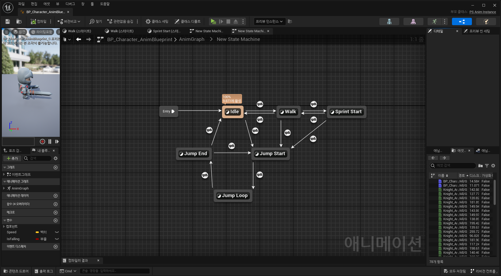
		</p>
		
		</details>
	
	- **시선 처리**: Tick()에서 회전값을 계산해 몸통과 머리 회전 및 RPC로 동기화
		<details>
			<summary> <em>코드 펼치기/접기</em></summary>
		<p>
			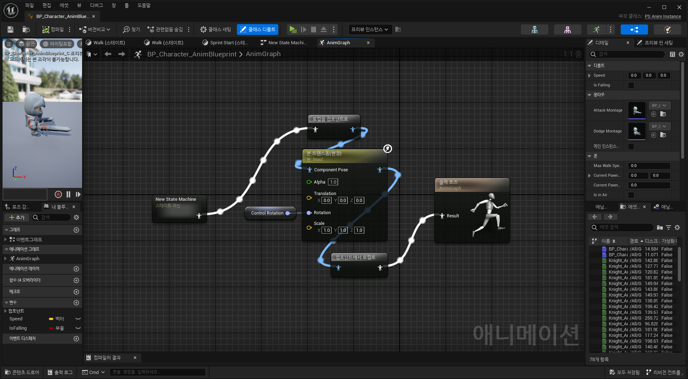
		</p>
			
		```c++
		void APS_Character::Tick(float DeltaTime)
		{
		  ︙
  			// 몸통 회전값 계산
			float ControlYaw = GetControlRotation().Yaw;
			float ActorYaw = GetActorRotation().Yaw;
			if (ActorYaw < 0) { ActorYaw += 360.0f; }
	
			// delta_angle이 70도가 될 때까지 캐릭터의 몸체는 움직이지 않음
			float DeltaAngle = ControlYaw - ActorYaw;
		    if (DeltaAngle < 0) { DeltaAngle += 360.0f; }
		    if (DeltaAngle > 180) { DeltaAngle -= 360.0f; }
	
			// delta_angle이 70도보다 커지면 몸체 회전
			// 오른쪽으로 회전
			if (delta_angle > 70)
			{
				ActorYaw += delta_angle - 70.0f;
				FRotator new_rotator = GetActorRotation();
				new_rotator.Yaw = ActorYaw;
				RotateActor(new_rotator);
				bIsTurning = true;
			}
			// 왼쪽으로 회전
			else if (delta_angle < -70)
			{
				ActorYaw += delta_angle + 70.0f;
				FRotator new_rotator = GetActorRotation();
				new_rotator.Yaw = ActorYaw;
				RotateActor(new_rotator);
				bIsTurning = true;
			}
	
			// 몸체가 정면을 바라보도록 천천히 회전
			if (FMath::Abs(ControlYaw - ActorYaw) <= 10.0f)
			{
				bIsTurning = false;
			}
			else
			{
				RotateActor(FMath::RInterpTo(GetActorRotation(), FRotator(GetActorRotation().Pitch, Controller->GetControlRotation().Yaw, GetActorRotation().Roll), GetWorld()->GetDeltaSeconds(), 5.0f));
			}

  			// 머리 회전값 계산
			HeadRotator.Roll = -GetControlRotation().Pitch + 90.0f;
			if (HeadRotator.Roll < 0)
			{
				HeadRotator.Roll += 360.0f;
			}
			HeadRotator.Roll = FMath::Clamp(HeadRotator.Roll, 90 - MAX_ROTATION_ROLL, 90 - MIN_ROTATION_ROLL);
			HeadRotator.Yaw = GetControlRotation().Yaw - 90.0f - GetActorRotation().Yaw;
		
			SetHeadRotator(HeadRotator);
		  ︙
  		}
		```
 
		```c++
		void APS_Character::RotateActor(FRotator NewRotator)
		{
			RotateActor_Server(NewRotator);
		}
		
		void APS_Character::RotateActor_Server_Implementation(FRotator NewRotator)
		{
  			// 서버에서 실행
			RotateActor_Client(NewRotator);
		}
		
		void APS_Character::RotateActor_Client_Implementation(FRotator NewRotator)
		{
			// 클라이언트에서 실행
			SetActorRotation(NewRotator);
		}
		
		void APS_Character::SetHeadRotator(FRotator NewRotator)
		{
			SetHeadRotator_Server(NewRotator);
		}
		
		void APS_Character::SetHeadRotator_Server_Implementation(FRotator NewRotator)
		{
  			// 서버에서 실행
			SetHeadRotator_Client(NewRotator);
		}
		
		void APS_Character::SetHeadRotator_Client_Implementation(FRotator NewRotator)
		{
			// 클라이언트에서 실행
			PS_AnimInstance->SetControlRotation(NewRotator);
		}
		```
 
  		```c++
	    void UPS_AnimInstance::SetControlRotation(FRotator Rotator)
		{
			ControlRotation = Rotator;
		}
    	```
		</details>

### 2. 게임 플레이 로직 구현 및 동적 UI 연동   
<p>
	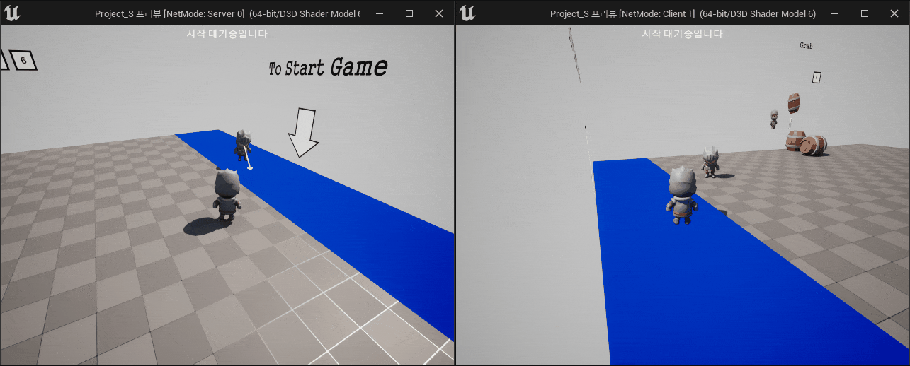
	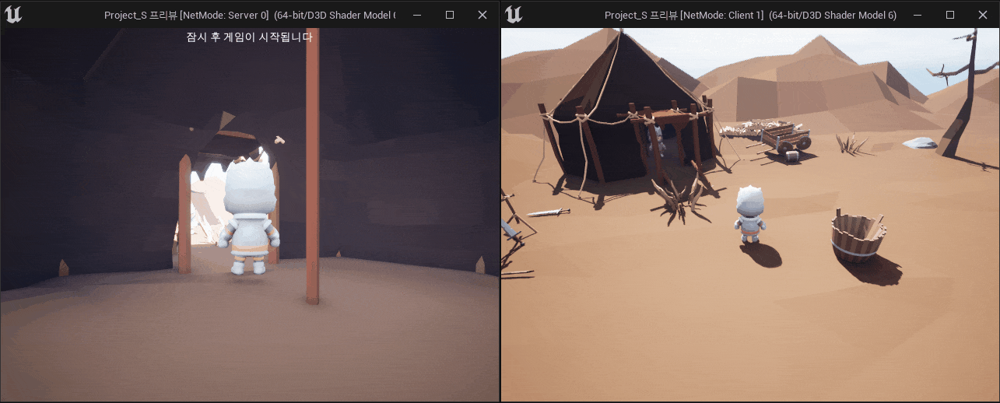
	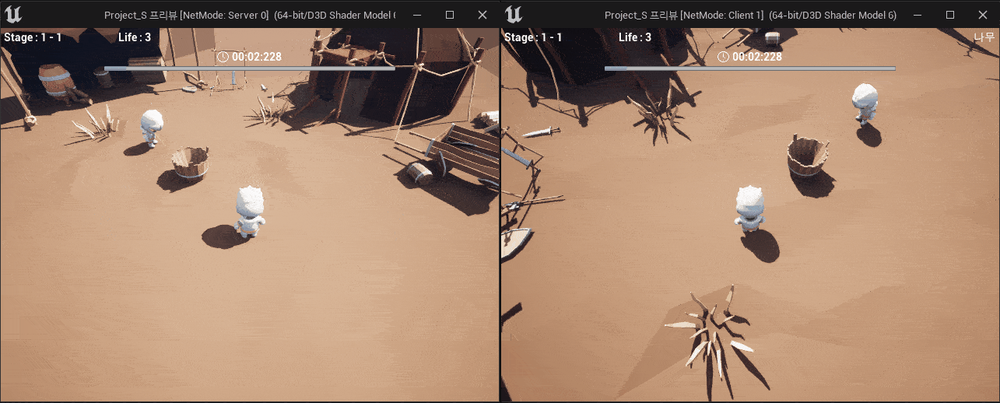
</p>

- **기능 설명**:   
 	- 로비의 특정 구역에 플레이어 두 명이 동시에 5초간 머무르면 맵 이동   
	- 플레이어가 번갈아 제한시간 내에 제시어·정답 선택   
	- 게임 플레이에 따른 맵·스테이지·라이프 등을 HUD에 실시간 반영

- **주요 기술**:
 	- **GameMode**를 활용한 게임 플레이 로직 구현   
  	- **GameState**·**PlayerState**의 **Property Replication**을 활용한 상태 동기화   
  
- **구현 방법**:
	- **맵 이동**: **BP_Portal**에서 **StartGameAfter5Seconds()** 호출 이후 5초가 지나면 **ServerTravel()**로 스테이지 전환
		<details>
			<summary> <em>코드 펼치기/접기</em></summary>
		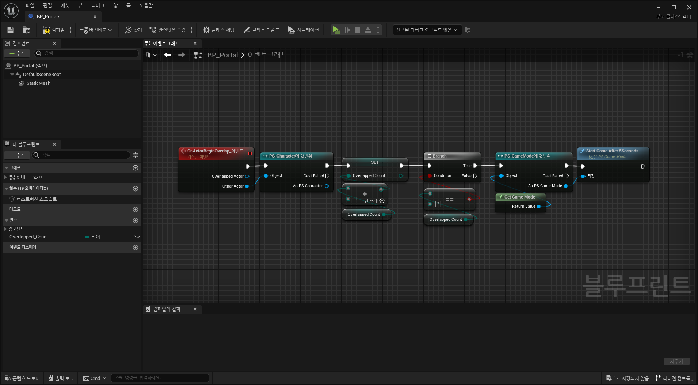
			
		```c++
		void APS_GameMode::StartGameAfter5Seconds()
		{
		  ︙
		    // 5초 타이머 설정
		    GetWorldTimerManager().SetTimer(StartGameTimerHandle, this, &APS_GameMode::OnStartGameAfter5SecondsComplete, GameStartWaitTime, false);
		  ︙
		}

  		void APS_GameMode::OnStartGameAfter5SecondsComplete()
		{
		  ︙
  			// 스테이지 전환 시작
		    TransitionToStage(1, 1);
		}

  		void APS_GameMode::TransitionToStage(uint8 MapNumber, uint8 StageNumber)
		{
		  ︙
  			// GameState 갱신
  		  ︙
  			// 해당 스테이지로 이동
		    GetWorld()->ServerTravel(TEXT("/Game/Maps/Level_0_new?listen"), true);
		  ︙
		}
		```
		</details>

	- **제시어·정답 선택**: **PlayerState**에서 선택한 단어를 **Replication**으로 동기화하고 **GameMode**가 이를 참조해 처리  
		<details>
			<summary> <em>코드 펼치기/접기</em></summary>
 
   		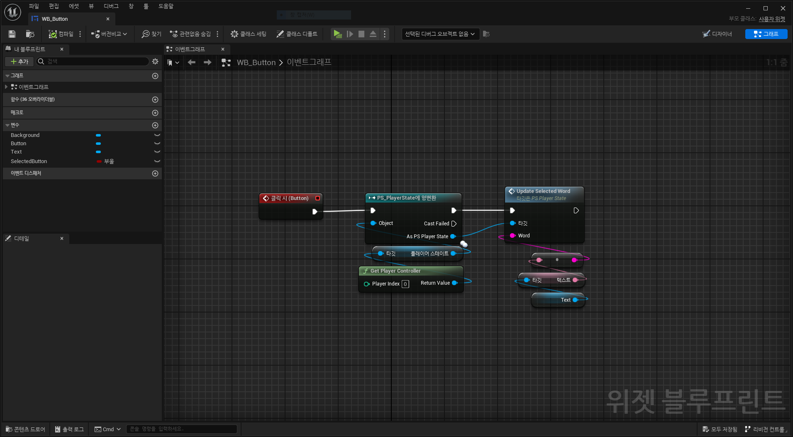

  		```c++
    	void APS_GameMode::OnFirstWordSelectionComplete()
		{
		  ︙
		    // 미선택 시 랜덤으로 선택
			int32 RandomIndex = FMath::RandRange(0, ButtonWords.Num() - 1);
			PS_PlayerState->UpdateSelectedWord_Server(ButtonWords[RandomIndex]);
		  ︙
		}

	     void APS_GameMode::FirstAnswerShow(int TimeLimit)
		{
		  ︙
			// 선택됨
		    if (PS_PlayerState->GetHasSelectedWord())
			{
				if (UsedWords.Last().Equals(PS_PlayerState->GetSelectedWord()))
				{
     				// 정답 처리
    		  		︙
				}
				else
				{
					// 오답 처리
    		  		︙
				}
			}
			// 미선택됨
			else
			{
				// 오답 처리
		  		︙
			}
		  ︙
		}
     	```
 
     	```c++
		void APS_PlayerState::GetLifetimeReplicatedProps(TArray<FLifetimeProperty>& OutLifetimeProps) const
		{
		  ︙
			// Property Replication 등록
			DOREPLIFETIME(APS_PlayerState, SelectedWord);
			DOREPLIFETIME(APS_PlayerState, bHasSelectedWord);
		}
      	
      	void APS_PlayerState::UpdateSelectedWord_Implementation(const FString& Word)
		{
			UpdateSelectedWord_Server(Word);
		}
		
		void APS_PlayerState::UpdateSelectedWord_Server_Implementation(const FString& Word)
		{
			// 서버에서 실행
			SelectedWord = Word;
			bHasSelectedWord = true;
			// 변경 사항 브로드캐스트
			OnWordChanged.Broadcast(SelectedWord);
			OnWordSelected.Broadcast(bHasSelectedWord);
		}
      	```
		</details>

  	- **동적 UI 연동**: **GameState**의 복제 변수를 갱신하면 클라이언트 **HUD**가 즉시 갱신  
		<details>
			<summary> <em>코드 펼치기/접기</em></summary>
			
		```c++
		void APS_GameState::GetLifetimeReplicatedProps(TArray<FLifetimeProperty>& OutLifetimeProps) const
		{
		  ︙
		    // Property Replication 등록
		    DOREPLIFETIME(APS_GameState, CurrentMap);
		    DOREPLIFETIME(APS_GameState, CurrentStage);
		    DOREPLIFETIME(APS_GameState, CurrentLife);
		    DOREPLIFETIME(APS_GameState, CurrentSelection);
		  ︙
		}

  		void APS_GameState::SetStage(int MapNumber, int StageNumber)
		{
		    CurrentMap = MapNumber;
		    CurrentStage = StageNumber;
  			// 변경 사항 브로드캐스트
		    OnMapChanged.Broadcast(CurrentMap);
		    OnStageChanged.Broadcast(CurrentStage);
		}
		
		void APS_GameState::SetLife(int NewLife)
		{
		    CurrentLife = NewLife;
  			// 변경 사항 브로드캐스트
		    OnLifeChanged.Broadcast(CurrentLife);
		}
		```

   		```c++
  	  	void APS_GameMode::FirstAnswerShow(int TimeLimit)
		{
		  ︙
			// 오답 처리
			PS_GameState->SetLife(--CurrentLife);
		  ︙
		}

  		void APS_GameMode::OnSecondAnswerShowComplete()
		{
		  ︙
		    if (CurrentStage > 10)
			{
		  		︙
				// 스테이지·라이프 갱신
				PS_GameState->SetStage(CurrentMap, CurrentStage);
				PS_GameState->SetLife(CurrentLife);
		  		︙
				// 다음 스테이지로 이동
				TransitionToStage(CurrentMap, CurrentStage);
			}
			else
			{
		  		︙
				// 스테이지·라이프 갱신
				PS_GameState->SetStage(CurrentMap, CurrentStage);
				PS_GameState->SetLife(CurrentLife);
		  		︙
				// 다음 라운드 진행
				PostStartFirstWordSelectionTimer(SelectionTime);
			}
		  ︙
		}
  	  	```
		</details>


### 3. 세션 관리


- **기능 설명**:  
	- **Host Game** : 세션 생성 및 호스트   
 	- **Find Session** : 세션 검색   
  	- **Join Session** : 세션 참가   
  	- **게임 나가기** : 세션 종료   

- **주요 기술**:  
	- **Online Subsystem** 기반 세션 API   
 	- 호스트 종료 시 **Client RPC**로 클라이언트 세션 종료

- **구현 방법**:
	- **세션 생성**: 세션 설정 후 Online Subsystem의 CreateSession() 호출   
		<details>
			<summary> <em>코드 펼치기/접기</em></summary>
			
		```c++
		void UPS_GameInstance::CreateSession(bool bMakePrivate, const FString& InPassword)
		{
		  ︙
		    // 세션 설정
			TSharedPtr<FOnlineSessionSettings> SessionSettings = MakeShareable(new FOnlineSessionSettings());
		  ︙
		    // 세션 생성 요청
		    const auto LocalPlayer = GetWorld()->GetFirstLocalPlayerFromController();
		    SessionInterface->CreateSession(*LocalPlayer->GetPreferredUniqueNetId(), CurrentSessionName, *SessionSettings);
		  ︙
		}
		```
  		</details>

	- **세션 검색**: 검색 파라미터 구성 후 Online Subsystem의 FindSessions() 호출  
 		<details>
			<summary> <em>코드 펼치기/접기</em></summary>
			
		```c#
		void UPS_GameInstance::FindSessions()
		{
		  ︙
		    // 검색 파라미터 구성
		    SessionSearch = MakeShareable(new FOnlineSessionSearch());
		  ︙
		    const auto LocalPlayer = GetWorld()->GetFirstLocalPlayerFromController();
		    SessionInterface->FindSessions(*LocalPlayer->GetPreferredUniqueNetId(), SessionSearch.ToSharedRef());
		  ︙
		}
		```
  		</details>

	- **세션 참가**: 참가할 세션의 인덱스 저장 후 Online Subsystem의 JoinSession() 호출
  		<details>
			<summary> <em>코드 펼치기/접기</em></summary>
			
		```c++
		void UPS_GameInstance::JoinSession(int32 SessionIndex, const FString& InPassword)
		{
		  ︙
  			// 참가할 세션의 인덱스 저장
		    const FOnlineSessionSearchResult& ChosenResult = SessionSearch->SearchResults[SessionIndex];
		  ︙
		    const auto LocalPlayer = GetWorld()->GetFirstLocalPlayerFromController();
		    SessionInterface->JoinSession(*LocalPlayer->GetPreferredUniqueNetId(), CurrentSessionName, ChosenResult);
		  ︙
		}
		```
  		</details>
	
	- **세션 종료**: Online Subsystem의 EndSession() 호출 후 Client RPC로 모든 클라이언트 세션 종료
  		<details>
			<summary> <em>코드 펼치기/접기</em></summary>
			
		```c++
		void UPS_GameInstance::LeaveSession()
		{
		  ︙
  			// EndSession() 호출
			SessionInterface->EndSession(CurrentSessionName);
		  ︙
		}

  		void UPS_GameInstance::OnEndSessionComplete(FName SessionName, bool bWasSuccessful)
		{
		  ︙
			// 호스트는 종료 전 모든 클라이언트에게 세션 종료 요청
  			if (bAmIHost)
  			{
		  		︙
  				for (FConstPlayerControllerIterator It = World->GetPlayerControllerIterator(); It; ++It)
				{
					APS_PlayerController* PC = Cast<APS_PlayerController>(It->Get());
					if (PC && !PC->IsLocalController())
					{
						PC->Client_OnHostEndSession();
					}
				}
		  		︙
  			}
  		  ︙
			// 세션 종료
			SessionInterface->DestroySession(CurrentSessionName);
		  ︙
		}

  		void UPS_GameInstance::OnDestroySessionComplete(FName SessionName, bool bWasSuccessful)
		{
		    bIsProcessingSession = false;
		    CurrentSessionName = NAME_None;
		}
		```
 
  		```c++
		UFUNCTION(Client, Reliable)
		void Client_OnHostEndSession();
		
		void APS_PlayerController::Client_OnHostEndSession_Implementation()
		{
			if (UPS_GameInstance* PS_GameInstance = Cast<UPS_GameInstance>(GetGameInstance()))
			{
				// 클라이언트 세션 종료
				PS_GameInstance->LeaveSession();
			}
		}
		```
  		</details>


## 🛠 이슈 및 해결 과정
### 1. 캐릭터 시선 Rotator 불일치
- **문제**   
  호스트 캐릭터는 시선 Rotator에 따라 정상적으로 회전\
  하지만 로컬 캐릭터는 시선 Rotator가 적용되지 않고 초기값으로 되돌아가는 현상이 발생   
  <div align="center">
	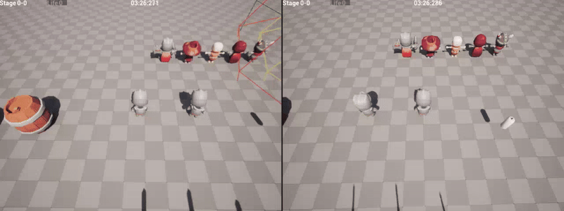   
  </div>
  
- **원인**   
  AnimInstance::NativeUpdateAnimation()에서 캐릭터 시선의 Rotator를 직접 계산하고 Bone을 회전한 것이 문제\
  AnimInstance 멤버 변수는 동기화 되지 않으므로 로컬에서 변경된 시선 Rotator가 다른 로컬에 전파되지 않음
	<details>
		<summary> <em>코드 펼치기/접기</em></summary>
		
	```C++
	// Before
	void UPS_AnimInstance::NativeUpdateAnimation(float DeltaSeconds)
	{
	  ︙
		// AnimInstance에서 ControlRotation을 직접 계산
		ControlRotation.Roll = -Character->GetControlRotation().Pitch + 90.0f;
		if (ControlRotation.Roll < 0)
		{
		  ControlRotation.Roll += 360.0f;
		}
		ControlRotation.Roll = FMath::Clamp(ControlRotation.Roll, 90 - MAX_ROTATION_ROLL, 90 - MIN_ROTATION_ROLL);
		ControlRotation.Yaw = Character->GetControlRotation().Yaw - 90.0f - Character->GetActorRotation().Yaw;
	  ︙
	}
	```
	</details>

- **해결**   
  로컬 캐릭터의 시선 Rotator가 변경되면 RPC를 통해 서버에 전달하고, 서버가 NetMulticast로 모든 클라이언트에 전파하도록 구조를 변경
	<details>
		<summary> <em>코드 펼치기/접기</em></summary>
		
	```C++
	// After
	void APS_Character::SetHeadRotator(FRotator NewRotator)
	{
	  // 로컬에서 서버로 RPC 요청
		SetHeadRotator_Server(NewRotator);
	}
	
	UFUNCTION(Server, Reliable)
	void SetHeadRotator_Server(FRotator NewRotator);
	
	void APS_Character::SetHeadRotator_Server_Implementation(FRotator NewRotator)
	{
	  // 서버에서 모든 클라이언트로 전파
		SetHeadRotator_Client(NewRotator);
	}
	
	UFUNCTION(NetMulticast, Reliable)
	void SetHeadRotator_Client(FRotator NewRotator);
	
	void APS_Character::SetHeadRotator_Client_Implementation(FRotator NewRotator)
	{
		PS_AnimInstance->SetControlRotation(NewRotator);
	}
	```
	</details>

- **결과**   
  캐릭터의 시선 Rotator가 호스트와 모든 로컬 클라이언트에서 동일하게 동기화되어 자연스러운 시선 처리를 연출   
  <div align="center">
	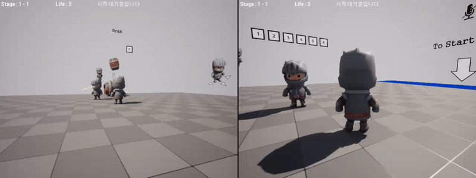
  </div>
	
### 2. 클라이언트 세션이 초기화되지 않는 현상
- **문제**   
  호스트가 세션을 종료하면, 클라이언트의 세션이 정상적으로 종료되지 않아 존재하지 않는 세션에 접근하는 문제 발생\
  이로 인해 클라이언트는 Find Session 목록을 갱신하지 못하고, 강제로 Host Game을 실행해야만 정상적으로 출력됨   
  <div align="center">
	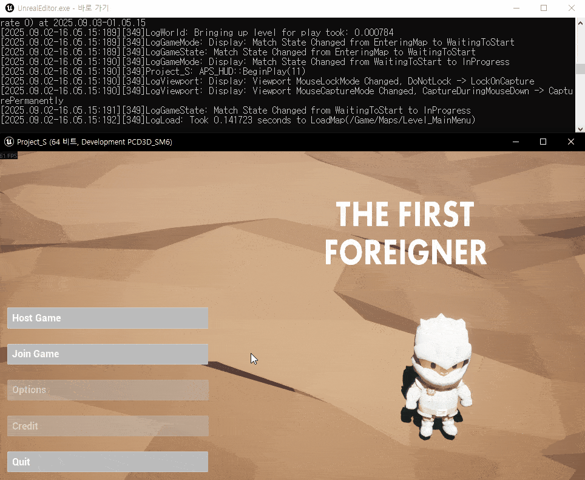   
  </div>
  
- **원인**   
  호스트가 클라이언트보다 먼저 세션을 종료해 클라이언트에서는 이미 없는 세션을 참조하는 상태가 됨
	<details>
		<summary> <em>코드 펼치기/접기</em></summary>
		
	```C++
	// Before
	void UPS_GameInstance::OnEndSessionComplete(FName SessionName, bool bWasSuccessful)
	{
	  ︙
		// 클라이언트 세션 종료 없이 호스트가 먼저 세션을 종료
		SessionInterface->DestroySession(CurrentSessionName);
	  ︙
	}
	```
	</details>

- **해결**   
  호스트가 세션을 종료하기 전에 모든 클라이언트를 순회하며 RPC를 통해 세션 종료를 요청하도록 변경\
  각 클라이언트는 GameInstance::LeaveSession()을 호출해 스스로 세션을 종료
	<details>
		<summary> <em>코드 펼치기/접기</em></summary>
		
	```C++
	// After
	void UPS_GameInstance::OnEndSessionComplete(FName SessionName, bool bWasSuccessful)
	{
	  ︙
		// 호스트 종료 전 모든 클라이언트에게 세션 종료 요청
		for (FConstPlayerControllerIterator It = World->GetPlayerControllerIterator(); It; ++It)
		{
			APS_PlayerController* PC = Cast<APS_PlayerController>(It->Get());
			if (PC && !PC->IsLocalController())
			{
				PC->Client_OnHostEndSession();
			}
		}

		// 호스트 세션 종료
		SessionInterface->DestroySession(CurrentSessionName);
	  ︙
	}
	
	UFUNCTION(Client, Reliable)
	void Client_OnHostEndSession();
	
	void APS_PlayerController::Client_OnHostEndSession_Implementation()
	{
		if (UPS_GameInstance* PS_GameInstance = Cast<UPS_GameInstance>(GetGameInstance()))
		{
			// 클라이언트 세션 종료
			PS_GameInstance->LeaveSession();
		}
	}
	```
	</details>

- **결과**   
  모든 클라이언트의 세션이 항상 정상적으로 종료되어 Find Session 목록이 정상적으로 출력됨   
  <div align="center">
	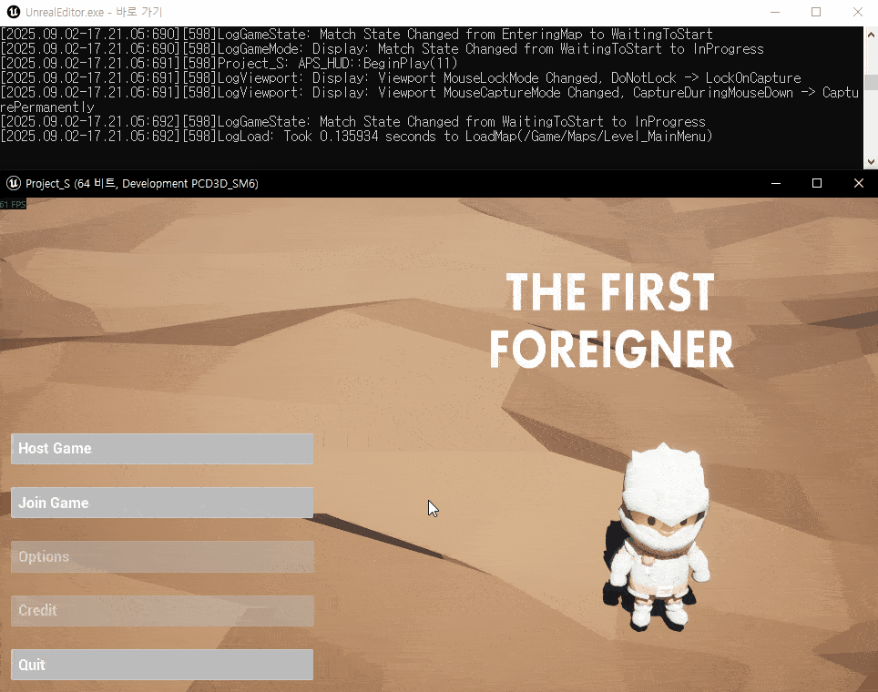   
  </div>

### 3. Steam 닉네임이 비정상적으로 출력
- **문제**   
  Find Session 결과에서 유저의 Steam 닉네임이 깨져 정상적인 구분이 불가능   
  <div align="center">
	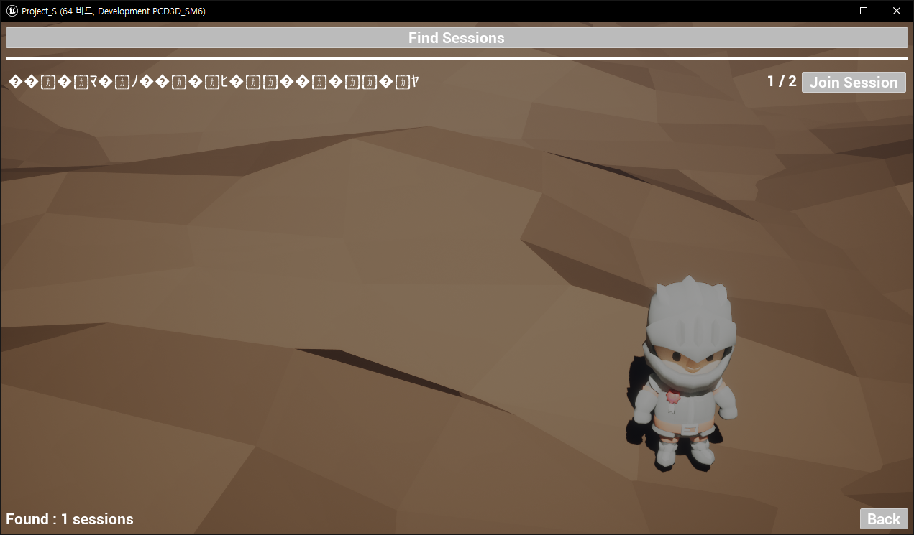   
  </div>
  
- **원인**   
  Steam 닉네임은 한글 등 비-ASCII 문자를 포함할 수 있음\
  Unreal Engine은 닉네임을 UTF-16 기반 FString으로 받아오지만, Online Subsystem의 메타데이터 전송 구간은 ASCII를 전제로 직렬화\
  이 과정에서 UTF-16 → ASCII으로의 변환 손실이 발생하여 닉네임이 깨짐
	<details>
		<summary> <em>코드 펼치기/접기</em></summary>
		
	```C++
	// Before
	void UPS_GameInstance::CreateSession(bool bMakePrivate, const FString& InPassword)
	{
	  ︙
		// 호스트의 닉네임을 FString으로 받아옴
		HostNick = Identity->GetPlayerNickname(*UserId);
	
		// FString을 변환 없이 그대로 SessionSettings에 저장
		SessionSettings->Set(FName("HostName"), HostNick, EOnlineDataAdvertisementType::ViaOnlineServiceAndPing);
	  ︙
	}
	```
	</details>

- **해결**   
  세션 생성시 호스트의 Steam 닉네임을 UTF-8 → Base64 인코딩해 전송\
  클라이언트는 Base64 → UTF-8 → FString 디코딩 과정을 거쳐 깨지지 않은 문자열을 복원
	<details>
		<summary> <em>코드 펼치기/접기</em></summary>
		
	```C++
	// After
	void UPS_GameInstance::CreateSession(bool bMakePrivate, const FString& InPassword)
	{
	  ︙
		// FString을 UTF-8로 변환
		FTCHARToUTF8 Utf8Host(*HostNick);
		
		// UTF-8을 Base64로 변환
		FString EncHost = FBase64::Encode(reinterpret_cast<const uint8*>(Utf8Host.Get()), (uint32)Utf8Host.Length());
		
		// SessionSettings에 저장
		SessionSettings->Set(FName("HostNameB64"), EncHost, EOnlineDataAdvertisementType::ViaOnlineService);
	  ︙
	}
	
	void UPS_GameInstance::OnFindSessionsComplete(bool bWasSuccessful)
	{
	  ︙
		// SessionSettings에서 문자열을 꺼냄
		FString EncHost;
		Settings.Get(FName("HostNameB64"), EncHost);
	
		// Base64를 UTF-8로 변환
		TArray<uint8> HostBytes;
		if (FBase64::Decode(EncHost, HostBytes))
			HostBytes.Add(0);
	
		// UTF-8을 FString으로 변환
		FString DecodedHost = UTF8_TO_TCHAR(reinterpret_cast<const char*>(HostBytes.GetData()));
	  ︙
	}
	```
	</details>

- **결과**   
  ASCII 외 문자를 포함한 Steam 닉네임도 깨지지 않고 정상적으로 출력   
  <div align="center">
	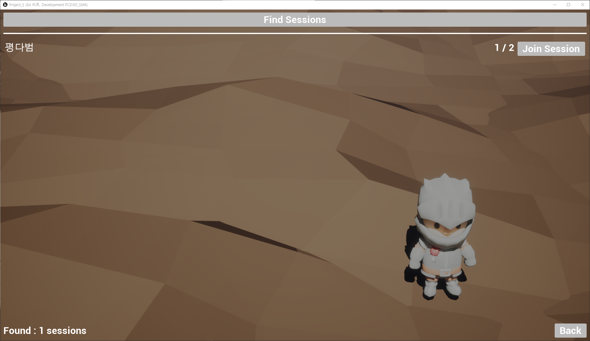   
  </div>

## 프로젝트 구조
```plaintext
Source/
├── Project_S/
│   ├── Project_S.h
│   ├── Project_S.cpp                       # 커스텀 로그 카테고리 선언
│   ├── PS_AnimInstance.h
│   ├── PS_AnimInstance.cpp                 # 폰의 상태에 대해 폰의 Transform 및 애님 블루프린트를 제어
│   ├── PS_BaseGrabUp.h
│   ├── PS_BaseGrabUp.cpp                   # 월드에 배치할 수 있는 액터로, 폰이 Grab하면 폰의 시선 방향에 액터가 고정됨
│   ├── PS_BasePickup.h
│   ├── PS_BasePickup.cpp                   # (미사용) 월드에 배치할 수 있는 액터로, 폰이 overlap하면 폰의 손에 무기로 장착됨
│   ├── PS_Character.h
│   ├── PS_Character.cpp                    # 유저가 직접 조종하는 폰으로, 키 바인딩과 같이 유저의 특정 행동에 대해 폰을 제어
│   ├── PS_Enemy.h
│   ├── PS_Enemy.cpp                        # (미사용) AI에 의해 월드를 돌아다니는 폰으로, 유저를 발견하면 추적함
│   ├── PS_GameInstance.h
│   ├── PS_GameInstance.cpp                 # Online Subsystem을 이용해 게임 호스트, 게임 참가를 구현
│   ├── PS_GameMode.h
│   ├── PS_GameMode.cpp                     # 게임의 규칙을 선언하고 게임의 흐름을 제어
│   ├── PS_GameState.h
│   ├── PS_GameState.cpp                    # 게임의 현재 상태를 저장하고 서버와 클라이언트 간에 상태를 동기화
│   ├── PS_Grabable.h                       # PS_BaseGrabUp 클래스의 인터페이스
│   ├── PS_HUD.h
│   ├── PS_HUD.cpp                          # UI와 GameState 간의 상태를 동기화하고 PlayerController의 행동에 대해 UI를 제어
│   ├── PS_Interactable.h                   # (미사용) BP_Interactable 클래스의 인터페이스
│   ├── PS_MainMenuPawn.h
│   ├── PS_MainMenuPawn.cpp                 # 메인 메뉴에 사용하는 폰
│   ├── PS_PlayerController.h
│   ├── PS_PlayerController.cpp             # 유저의 입력을 처리하고 UI와 Session을 관리
│   ├── PS_PlayerState.h
│   ├── PS_PlayerState.cpp                  # 클라이언트의 상태(SelectedWord)를 저장하고 서버와 클라이언트 간에 상태를 동기화
│   ├── PS_TimeUtility.h
│   ├── PS_TimeUtility.cpp                  # 블루프린트의 커스텀 노드를 선언 및 정의
└── └── PS_Words.h                          # DataTable의 Row를 커스텀으로 정의하기 위한 구조체
Content/
├── Blueprints/
│   ├── Grabup/
│   │   ├── BP_Grabup.uasset            # PS_BaseGrabUp을 상속 받는 Base 애셋
│   │   ├── BP_Grabup_*.uasset          # BP_Grabup을 상속 받아 구현한 애셋들
│   ├── Pickup/
│   │   ├── BP_Pickup_Weapon.uasset     # (미사용) PS_BasePickup을 상속 받는 Base 애셋
│   │   ├── BP_Pickup_*.uasset          # (미사용) BP_Pickup_Weapon을 상속 받아 구현한 애셋들
│   ├── UI/
│   │   ├── MainMenu/
│   │   │   ├── WB_MainMenu_*.uasset    # 메인 메뉴에서 사용하는 UI들
│   │   ├── Session/
│   │   │   ├── WB_Session_*.uasset     # 세션 메뉴에서 사용하는 UI들
│   ├── WB_*_HUD.uasset                 # 게임 내에서 사용하는 UI들
├── Inputs/
│   ├── IA_*.uasset                     # 각 Action에 대한 값과 트리거를 설정
└── └── IMC_Default.uasset              # InputAction과 키를 매핑
```
